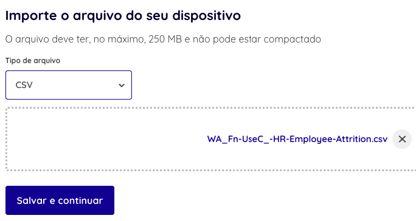
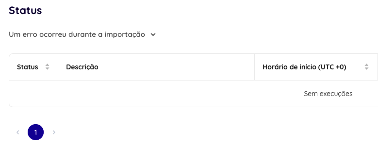

# [&lt;- Voltar](../SUMARIO.md)

# Item 1 - Sobre Troubleshooting

#### Imagine que você é um analista de suporte e recebe um chamado do cliente reportando um problema na importação dos dados da Dadosfera. Você deve responder como se estivesse interagindo com o cliente no atendimento do chamado. O erro ocorreu nesta pipeline de coleta na Dadosfera. Sugira a alteração a ser feita no Dataset e escreva sobre outros cuidados que nosso usuário deve ter quando carregar dados do Google Sheets para a plataforma. Utilize a documentação da Dadosfera para entender como baixar os logs.

Caro usuário, a importação manual de arquivos é recomendada caso seus dados não sejam atualizados com frequência.

São suportados arquivos no formato CSV, JSON e Parquet, caso seu arquivo não esteja dentro das possibilidades acima, recomendamos que ele seja importado para uma ferramenta de armazenamento (de objetos, como o AWS S3 ou de arquivos, como o Google Drive/Sheets) e seja criada uma pipeline à partir desta fonte.

Você deve especificar o tipo do arquivo e selecioná-lo, detalhe, ele não pode ter mais que 250 mb.

[Link](https://app.dadosfera.ai/pt-BR/collect/import-files/create/file) para importação de arquivos.

Depois deve informar o tipo de codificação, o separador e se o arquivo possui cabeçalho.

Caso haja algum problema na importação você pode acompanhar os logs de erros, e após as devidas correções importar novamente o arquivo.

Para mais detalhes clique [aqui](https://docs.dadosfera.ai/docs/google-sheets).

Além disse verifique os tipos de dados que compõem sua planilha, os dados suportados são:

| Classificação     | Tipo de dados                                                                                                                |
| ----------------- | ---------------------------------------------------------------------------------------------------------------------------- |
| Numéricos         | number, decimal numeric, int, integer, bigint, smallint, byteint, float, float4, float8, double, double precision, real |
| String e binários | varchar, char, character, string, text, binary, verbinary                                                                    |
| Lógicos           | boolean                                                                                                                      |
| Data e hora       | date, datetime, time, timestamp, timestamp_ltz, timestamp_ntz, timestamp_tz,                                            |
| Semiestruturados  | variant, object, array                                                                                                       |
| Geoespaciais      | geography                                                                                                                    |

Outros tipos de dados irão quebrar durante a tentativa de importação.

# [&lt;- Voltar](../SUMARIO.md)
