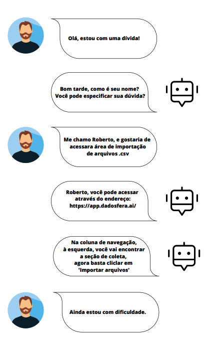
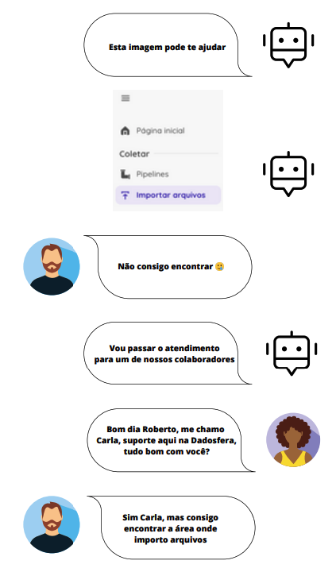
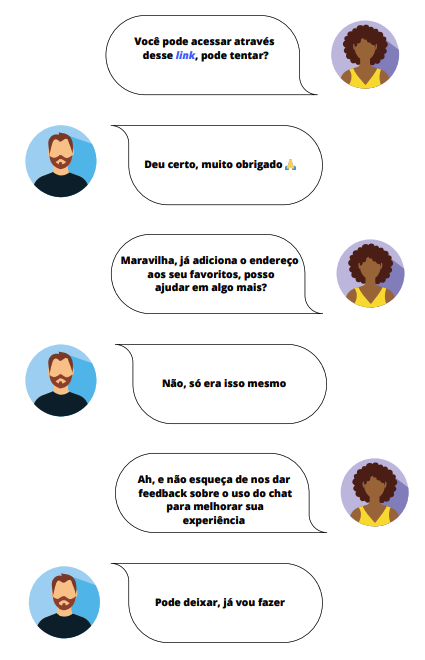

# [&lt;- Voltar](../SUMARIO.md)

# Item 3 - Sobre Boas-Práticas de Suporte

#### Suponha que você tenha acesso a uma ferramenta de Chatbot com AI robusta que possa ser integrada à Dadosfera para melhorar a interação do cliente. Como você implementaria essa ferramenta para melhorar a satisfação e o envolvimento do cliente?

A incorporação de um Chatbot com AI robusta é uma ótima maneira de melhorar a interação do cliente. Para implementar essa ferramenta e melhorar a satisfação do cliente eu iria:

1. Identificar os objetivos específicos para o Chatbot, como fornecer suporte ao cliente, responder a perguntas frequentes, ajudar na navegação da nova plataforma, etc;
2. Avaliar e escolher uma plataforma de Chatbot com AI que seja capaz de se integrar facilmente com os sistemas existentes na Dadosfera;
3. Desenvolver os fluxos de conversação do Chatbot com base nos cenários e perguntas mais comuns dos clientes;
4. Treinar o Chatbot utilizando dados históricos de interações dos clientes;
5. Usar, na interface, elementos visuais, como botões de resposta e carrosséis, para facilitar a navegação;
6. Coletar feedback dos clientes sobre a experiência com o Chatbot;
7. Promover o Chatbot por meio de anúncios no site Dadosfera e em comunicações por e-mail.

#### a) Desenhe o processo do fluxo do processo de atendimento, incluindo interações entre usuário, máquina (IA como o GPT ou outra), documentação (docs.dadosfera.ai) e humano (Suporte Dadosfera).

Usuário inicia a interação -> Interação com a IA -> Usuário descreve a necessidade ->

IA responde com informações iniciais -> IA oferece ajuda detalhada ->

Usuário pede mais clareza -> IA facilita transição para suporte humano ->

Humano entra em ação e assume a conversa e resolve o problema ->

Após a resolução do problema, o representante humano agradece ao usuário e incentiva o fornecimento de feedback sobre a interação.

b) Exemplifique, com um print de um prompt e uma resposta, como que uma IA poderia ajudar nesse atendimento. Sugerimos o uso de ChatGPT ou Bard

# [&lt;- Voltar](../SUMARIO.md)
