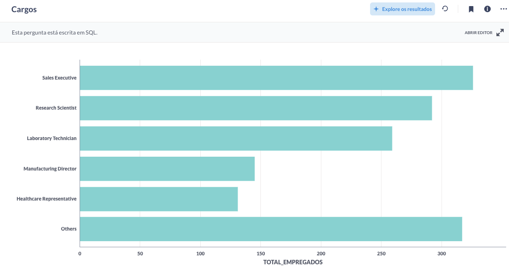
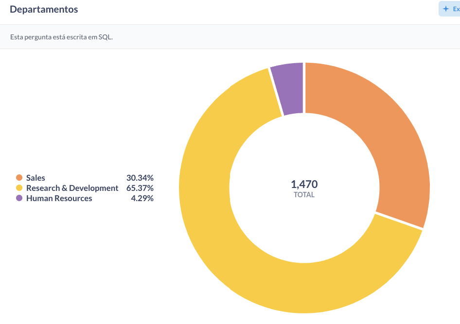

Query SQL:

SELECT
CASE
WHEN jobrole IN ('Sales Executive',
'Research Scientist',
'Laboratory Technician',
'Manufacturing Director',
'Healthcare Representative')
THEN jobrole
ELSE 'Others'
END AS cargos,
COUNT(\*) AS total_de_empregados
FROM TB**TAEZZB**EMPLOYEE
GROUP BY cargos;

Link: https://metabase-treinamentos.dadosfera.ai/question/228-cargos

Query SQL:

SELECT department, COUNT(\*) AS total_de_empregados
FROM TB**TAEZZB**EMPLOYEE
WHERE department IN ('Human Resources', 'Research & Development', 'Sales')
GROUP BY department;

Link: https://metabase-treinamentos.dadosfera.ai/question/229-departamentos
